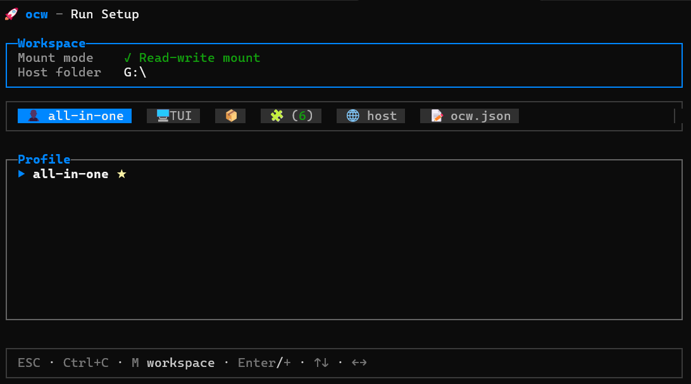

# OpencodeWrap

**Run OpenCode in Docker—no config needed.**

Your data persists. Your settings follow you. Just type `ocw run`.

---

## Highlights

- **Zero setup** — One npm install, then just run
- **Your data stays** — Everything persists across sessions
- **Smart profiles** — Built-in all-in-one setup plus custom profiles
- **Session addons** — Drop in custom tools and configurations
- **Auto-updates** — Always on the latest OpenCode
- **Your choice of UI** — TUI or web browser
- **Works everywhere** — Linux, macOS, Windows

---

## Install

```bash
npm i -g @farsight-cda/ocw
```

Docker required.

---

## Quick Start

```bash
ocw run
```

Choose your UI and start coding with the built-in all-in-one profile or your own custom one.



---

## Built-in Profiles

| Profile | Best For |
|---------|----------|
| `all-in-one` | Combined frontend, .NET, Go, Rust, Postgres/data, and Solidity tooling |

Create your own with `ocw profile add <name>`.

---

## Session Addons

Enhance your sessions with custom configurations:

- Drop addon folders in `~/.opencode-wrap/addons/`
- Enable them when running `ocw run`
- `AGENTS.md`, root `.env`, and `opencode/opencode.json` are merged across the profile and active addons
- Built-in addons include **question-affinity** (AGENTS.md behavior instructions), **web-search** (enable Exa search), **cursor-auth** (Cursor OAuth plugin), and **frontend-design** (installs the frontend design skill)

---

## License

MIT

---

<p align="center">Built for the OpenCode community</p>
